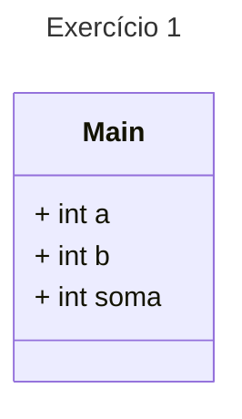
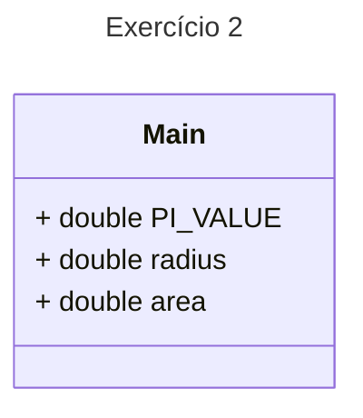

# 🖥️ Lógica de Programação

## 🗄️ Repositório destinado aos exercícios fundamentais de lógica de programação.

### 📝 Exercício 01

#### Faça um programa para ler dois valores inteiros, e depois mostrar na tela a soma desses números com uma mensagem explicativa, conforme exemplos.


| Entrada  | Saida      |
| -------- | ---------- |
| 10 e 30  | Soma = 40  |
| -30 e 10 | Soma = -20 |
| 0 e 0    | Soma = 0   |


```mermaid
---
title : Exercício 1
---
classDiagram
class Main{
    + int a
    + int b
    + int soma
}

```
```


```java
import java.util.Scanner;

public class Main {
	public static void main(String[] args) {
		Scanner scan = new Scanner(System.in);
		int a, b, soma;
		
		System.out.println("Enter the first number: ");
		a = scan.nextInt();
		
		System.out.println("Enter the second number: ");
		b = scan.nextInt();
		
		soma = a + b;
		System.out.println("Soma = " + soma);
		
		scan.close();
	}
}
```

### 📝 Exercício 02

#### Faça um programa para ler o valor do raio de um círculo, e depois mostrar o valor da área deste círculo com quatro casas decimais conforme exemplos.

##### Fórmula da área: area = π . raio^2

##### Considere o valor de π = 3.14159

| Entrada | Saida          |
| ------- | -------------- |
| 2.00    | A = 12.5664    |
| 100.64  | A = 31819.3103 |
| 150.00  | A = 70685.7750 |


```mermaid
---
title : Exercício 2
---
classDiagram
class Main{
    + double PI_VALUE
    + double radius
    + double area
}

```
```

```java
import java.util.Scanner;

public class Main {
	public static void main(String[] args) {
		Scanner scan = new Scanner(System.in);
		//Declaring your own final Pi
        final double PI_VALUE = 3.14159;
        double radius;
       
        System.out.println("Enter the value of radius: ");
        radius = scan.nextDouble();
        
        double area = PI_VALUE * (radius * radius);
        
        System.out.printf("A = %.4f", area);
        
		scan.close();
	}
}

```